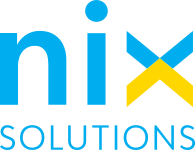
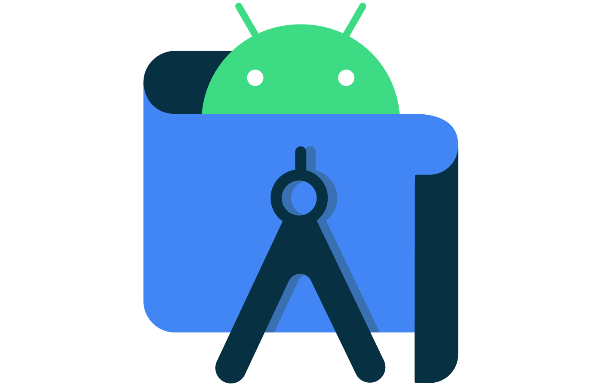
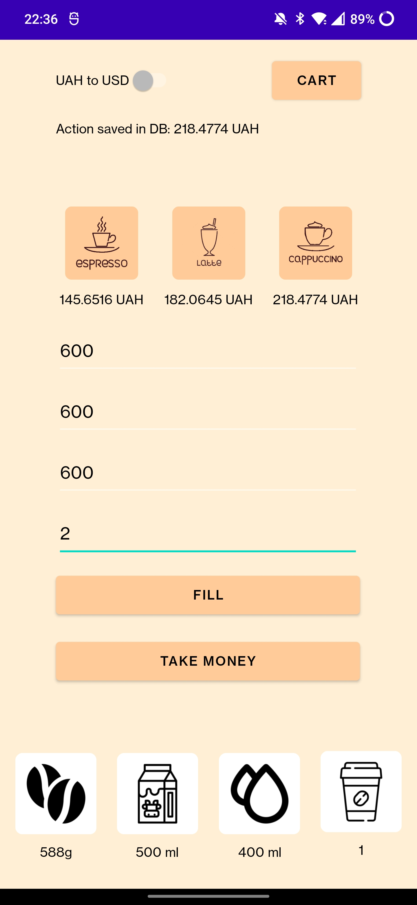

# Nix Summer Practice Final Project
Summer practice in NIX 04.07.2022-25.07.2022

## Technologies
- Kotlin
- AndroidStudio
- SQLLite
- ExchangeRate-API

## Project
Coffee machine shop app for android.

| Functionality      |
|--------------------|
| Buy different type of coffee|
| Fill coffee machine resources|
| Convert the cost from USD to UAH and vice versa|
| Save purchases in DataBase|
| Take money from coffee machine|

## Interface

